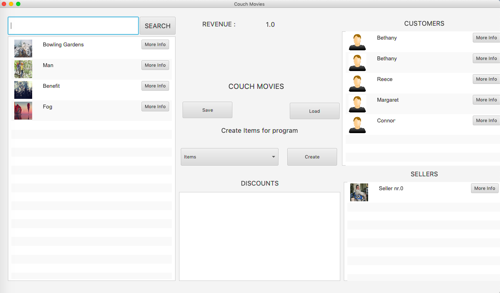

# NetflixSimulation
It is simulation of video market, where seler, customer and products are. The simulation shows how seler and customer behave
if the new move is in the market, how much customers buy it and how much seler earn on this business. When the market bring losses
the program ends of working.

For the project I used Java8 and JavaFX for layout.

