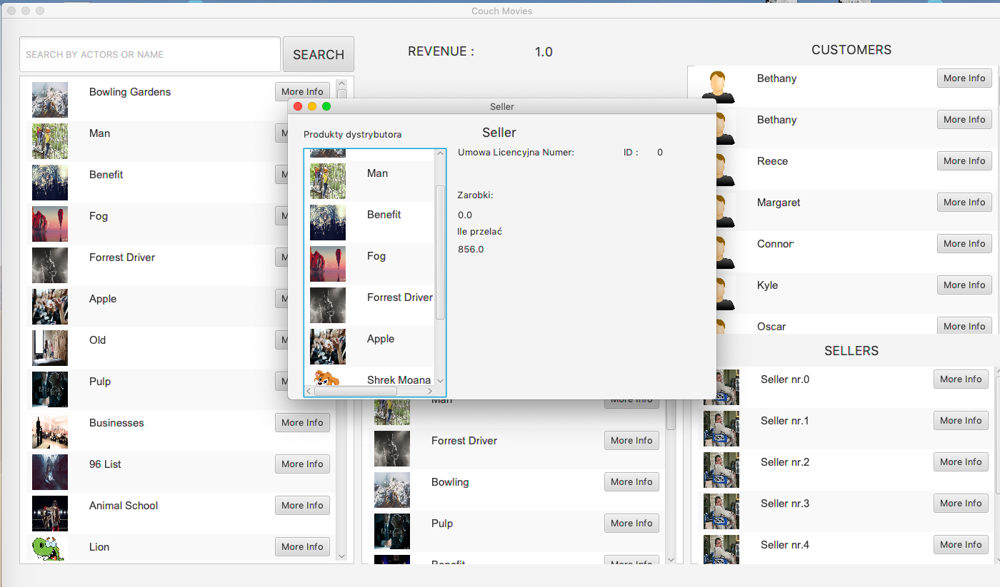

# NetflixSimulation 🎥 💻 
It is simulation of video market, where seller, customer and products are. The simulation shows how seller and customer behave
if the new move is in the market, how much customers buy it and how much seller earns on this business. When the market bring losses
the program ends of working.

For the project I used Java8 and JavaFX for layout.

# Main window

# Movie window

# Seller and User window

